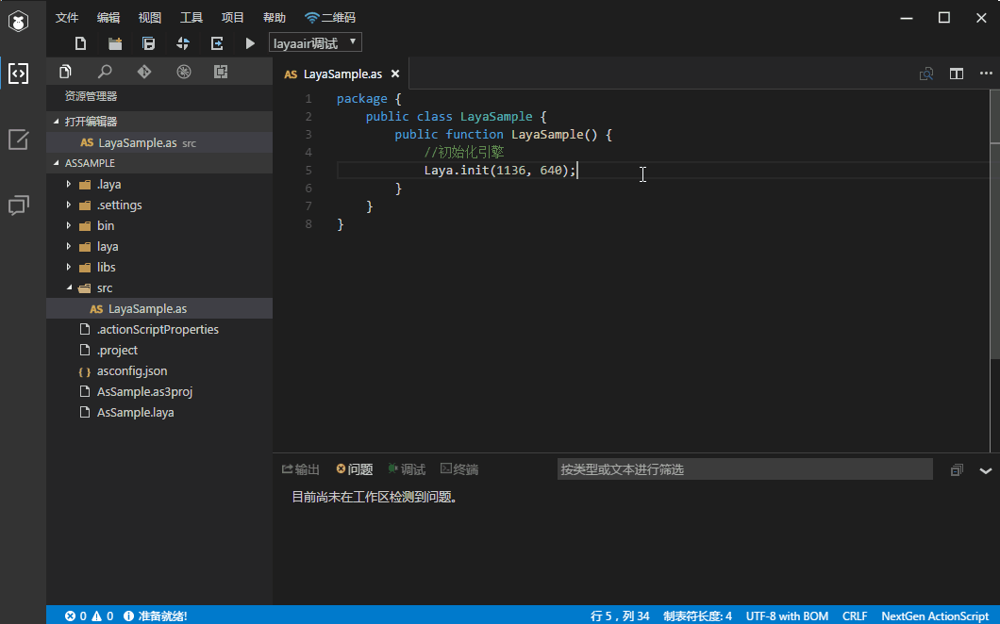
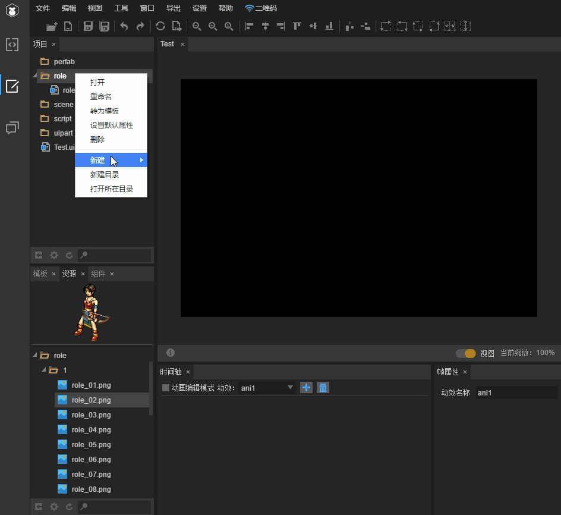

##1.5.0##
----------------------------------------
####2D####
新增龙骨Mesh动画及事件的支持

Input增加type属性，可以设置为password,email,number等

增加按钮文本换行的支持（文本\n文本）

修复声音加载失败不抛事件的问题

修复Sprite在父对象缩放后，拖拽位置不准确的bug

修复用createFrames方法创建动画播放失败的问题

####3D####
新增自定义材质

新增自定义Shader

新增多camera支持

新增camera排序

新增自定义RenderTexure

新增天空球

修复某些情况动画不能播放bug

修复透明物体排序错乱问题

###LayaAirIDE###
提供IDE扩展API，现在可以扩展IDE功能了，自己动手打造个性功能吧

下载地址：https://github.com/layabox/layaair-ide-api

提供IDE内UI组件表现类库，可以更改UI组建在编辑器的表现了

下载地址：https://github.com/layabox/layaair-ide-ui

优化导出代码效率，减少大型项目发布所花费的时间

支持自定义编译Task任务功能

增加是否导出预设的选项，方便预设在代码中实例

增加网格编辑组件，可以在IDE里面设置地图网格数据了

增加切断预设功能(右键)，增加预设颜色区分

###### 功能优化：

改进控制台，问题，调试，终端等面板的布局，使其使用更加方便

点击节点树空白区域，视图返回根节点，更加复合使用预期

增加防治双击选中图标的处理

动画编辑时，可以使用Enter键切换动画播放暂停了

解决帧率第一次修改不起作用的问题

属性为数字的输入框，可以拖动鼠标微调值了

新建目录面板打开后输入框自动获得焦点，方便输入

删除对话框，直接点击回车确定删除或者Esc键取消删除

新增同时选中多个图片，拖入时间轴快速创建一个序列帧动画

新增节点树按shift键多选操作

改进节点树选中时，可忽略锁定状态，方便修改锁定对象属性

修复多级目录重命名不对的问题

修复内置服务器端口冲突导致服务器开启失败

###### AS3语言服务（测试版）

使用NextGen ActionScript为AS提供语言服务。

详细参见https://github.com/BowlerHatLLC/vscode-nextgenas

- ActionScript文件的**语法高亮**。
- **智能感应**提供自动完成的导入、类型和成员访问。
- **签名帮助**显示调用函数时参数列表。
- 实时检查输入时的**错误和警告**。
- **经过**符号时显示更多诸如类型、命名空间等细节。
- Ctrl+Click 符号用来**跳转至定义**。
- 在项目内对符号**查找所有引用**。
- **重命名**类成员和局部变量。

##1.4.0##

----------------------------------------
####2D####
增加Spine形变动画支持，增加切换渲染顺序的功能，优化骨骼动画性能

Loader批量加载时，增加对type的使用（作为未自定type的默认type类型）

Animation类增加loadAnimation接口，实现加载ide制作的动画效果

Event增加stageX，stageY属性

TextArea 增加设置滚动条

增加Stage的鼠标滑轮事件支持

修复焦点在输入框间切换（多行和单行间互相切换）时报错

修改矢量图绘制发生错乱的BUG

####3D####
优化骨骼动画内存占用

增加TextureCube类型Loader

增加材质无深度测试混合模式

增加骨骼动画缓存速率接口

统一动画播放接口到AnimationPlayer

修复修改材质混合模式后staticBatch失效问题

增加动态合并机制,提升性能

###LayaAirIDE###
新功能：

Graphics动画

	通过新建菜单，可以创建Graphics动画了，轻松制作高性能的动画效果，比如角色动画，UI动画，特效动画
脚本扩展
	

	如果觉得组件功能不够用，现在增加了新的扩展方式，创建一个扩展脚本（ide只是增加脚本配置信息，脚本逻辑可以用不同语言书写），

	直接修改组件行为，甚至增加新的属性，比如按钮+扩展脚本=更个性化的按钮 Sprite+Role扩展脚本=Role类

	同时还可以添加多个附加脚本来扩展。扩展脚本和附加脚本的区别：扩展脚本继承自组件本身，附加脚本只修改组件，不继承

预设

	如果你修改了某个组件的行为，想作为模板保存下来，拖入别的场景直接用，并且再次修改这个组件，全部使用的地方均能跟着变化

	那么预设就是你想要的，比如创建了一个Sprite组件，拖入动画，设置一些属性，甚至附加Role脚本，然后保存为预设，以后就可以直接拖入场景使用
增加更多右键快捷菜单，使用更方便

增加3D粒子模式

改进IDE树节点操作体验

Code模式增加文件Icon显示

新增文件模板，用来快速创建类对象

增加App打包管理器

##1.3.0##
----------------------------------------
###类库###
####2D####
完善Input在移动平台的兼容性

完善Spine骨骼动画支持，完善柔体动画

增加Spine骨骼动画事件派发

Input类增加setSelection接口，设置光标位置

修复Node类contains接口不对的bug

修复flash模式下socket发送接收二进制数据失败的问题

####3D####
增加场景视锥体自动裁剪,提升大型场景中的性能

增加天空盒功能

闪光和粒子系统分别增加各自Render接口,统一材质概念

修改自动静态合并机制为手动

修复刚体动画BUG

修复闪光禁用后再启动显示BUG

修复调用实例材质后修改混合模式无效BUG

###LayaAirIDE###
新增场景编辑功能（测试版）

	1.IDE内拖动Sprite，Animation，Text到场景中

	2.IDE内拖动圆形，矩形，多边形等矢量图到任意精灵内

	3.IDE内拖动swf动画到场景中

	4.IDE内拖动声音设置播放控制

	5.IDE内拖动一个精灵对象作为遮罩体，实现遮罩功能

	6.IDE内拖动一个Graphics作为碰撞体，来设置某个对象的点击区域

	后续还会有更强的功能放出，敬请期待

改进IDE布局方式，布局更加合理

IDE内集成社区浏览功能

改进设计视图代码模式，增加高亮，更加好看易用

改进了IDE更新流程

增强节点多选控制功能

增加组件面板

组件拖动到其他父容器上时保持相对stage坐标不变

改进默认面板布局，修复错乱bug

修复js合并功能，忽略注释的js

###LayaRuntime###
增加webview的支持，webview中的js和runtime的js可以进行相互调用

改进下载模块，版本更新校验除dcc模式外，还可以根据版本号自行控制

修复XmlHttpRequest在ios下的内存泄露问题

修复Xml解析在ios下的内存泄露问题

##1.2.0##
----------------------------------------
###类库###
####2D####
增强Sprite的hitArea属性，除了赋值一个矩形区域以外，还可以赋值一个HitArea实例，来创建不规则的碰撞区域

比如：

var area = new HitArea();

//设置一个圆形区域作为碰撞区域

area.hit.drawCircle(0, 0, 50, "#ff0000");

//设置一个矩形区域作内不可碰撞区域

area.unhit.drawRect(0, 0, 20, "#ff0000");

//把这个碰撞区域设置给精灵

sp.hitArea = area;

完善骨骼动画，支持spine的mesh动画(由于数据格式不兼容，需要用最新的IDE重新转换一次)

改进移动端输入框展示方式，增加兼容性

TextArea文本框增加滚动条功能支持

UI 9宫格增加对repeat填充的支持

改进MovieClip的destory方法，destory后，会自动释放使用的资源

改进对话框模式窗口弹出，不再隐藏下面的对话框了

增加HttpRequest解析数据的容错处理

实现flash模式下右键事件

播放声音增加起始时间的参数

Texture增加getPixels获取像素点

Sprite增加globalScaleX，globalScaleY属性，方便获取全局缩放值

失去焦点停止背景音乐时记录背景音乐播放信息，重放时恢复

修复特定条件下，点击下拉框按钮不能正确收回弹出列表的bug

修复DrawCall不准确的bug

修复ScrollBar的end事件触发不及时的bug

####3D####
调整抗锯齿接口

调整MeshSprite3D材质相关属性到MeshRender内

调整MeshSprite3D几何体数据相关属性到MeshFilter内

增加材质渲染模式接口

增加实例材质接口

增加刚体动画

增加骨骼动画区间播放功能

MeshSprite3D增加碰撞盒和碰撞球数据

修复AnmtionPlayer播放endTime=0报错BUG【感谢：冰风痕】

修复动画跨帧播放跳帧问题

修复实例材质BUG【感谢：Jie】

###LayaAirIDE###
优化TS编译时间，增加增量编译功能

内置调试器增加堆栈错误打印，精确定位错误代码

增加龙骨批量转换(遍历文件夹)

改进代码导出，自动import非ui包的类

点击空白处，不再显示父容器属性

页面数据保存格式化的json，方便svn对比

对节点树多选后，编辑区也会同时多选

修复html文档在添加js标签出现绝对路径问题

修复谷歌调试下重新打开标签的问题

##1.1.0##
###类库###
####2D####
优化LayaPlayer的性能，性能提升50%，修正已知bug，提高稳定性

更改了节点的Display事件的顺序（子对象先触发）

优化LoaderManager的clearUnLoaded方法 【感谢：黑色礼服】

增加输入框对IOS下QQ浏览器中，使用Iframe情况下的兼容

加载队列增加cancelLoadByUrl和cancelLoadByUrls 【感谢：醉西游团队】

MovieClip增加playing状态获取

cacheAs内容大小大于2048时，不再抛出异常，而是给出警示信息

Animation增加通过label播放的功能

SoundManager更改属性autoStopMusic的默认值为true（默认失去焦点，停止声音播放）

ScrollBar类公开upButton，downButton，slider等控件，以便访问

Graphics增加fillTexture函数，实现位图重复填充效果

Tween增加progress属性设置，方便更改Tween的进度

Byte类readUTFBytes参数为0时改为返回""

修复UI9宫格Cache导致内存泄漏的bug

修复遮罩对象变化，被遮罩刷新不及时的bug 【感谢：紫琥珀姐姐】

####3D####
增加地形类

增加地形类A*寻路算法组件

增加通过相机类转换射线函数

修复骨骼挂点BUG【感谢：冰风痕、小新】

修复删除结点报错BUG【感谢：Jie、冰葑の】

修复复用Mesh动画错乱问题【感谢：Jie、冰葑の】

修复动画实时计算闪帧BUG【感谢：Jie、冰葑の】

###LayaAirIDE###
导出代码增加“加载模式”（F9项目设置里面更改）

修复多标签页超出时点击按钮弹不出隐藏的标签页的问题

修复转换旧项目时缺少配置文件导致的卡死

修复当有anchor值时修改宽高选择框中的pivot标识没有更新的问题

修复List特定情况下双击无法退出的问题

##1.0.4##
###类库###
####2D####
新增debugtool工具，方便调试树节点及性能

新增视频，照相机，陀螺仪，重力感应，地理定位等设备功能支持

TimeLine类增加to,from静态方法支持

TimeLine类增加to,from链式写法的支持(TimeLine.to().to().to()...) 【感谢：hidden】

Tween类的props参数增加duration,ease,complete,update等属性设置的支持

对象池Pool类增加clearBySign方法,用来清除对象缓存

增加鼠标样式控制类(Mouse),方便控制浏览器内的鼠标样式

List类的tweenTo方法增加complete回调函数

Byte类增加buffer属性，方便获取原始ArrayByffer数据

修复MovieClip第一次frame不从0开始的问题

修复在时间轴上直接放位图播放有问题的bug

修复两个loadimage导致的显示错误

修复Animation的complete事件延迟一帧触发的bug【感谢：topwcd】

####3D####
增加HeightMap类，高度图相关功能

增加Picker类，鼠标拾取相关功能

增加摄像机正交投影功能

增加摄像机生成射线功能

修改摄像机Viewport机制，更易用合理

修复切换动作骨骼动画错乱Bug

修复删除节点模型没有移除Bug

###LayaAirIDE###
新增Spine骨骼动画的转换（暂时还不支持mesh动画）

优化切换到代码模式后cpu占用

优化Ts自动引用JS的算法，减少引用先后顺序的错误率

非数字属性不再进行缓动

修复拖动中心点时删除anchoXY的bug

修复删除资源后列表选择状态没有变化

修复特定组件非打包时没正确打包的bug

修复删除left right等属性时属性面板数值变成NAN的问题

修复设置资源默认属性后，发布没有用最新的属性的问题

修复字体文件超过5个时ide加载资源不成功的问题

##1.0.3(测试版)##
###类库###
####2D####
CheckBox和Radio增加iconOffset属性，方便调整图标位置

优化Input移动端样式表现

Browser类增加onSafari属性，浏览器宽高获取优先使用innerHeight

兼容用户自行更改canvas的left，top导致鼠标点击失效的问题

修复骨骼动画旋转角度的问题

修复view中创建动画的方案，解决ts中没有ani的问题

修复Panel不能正确处理display事件的bug 【感谢：豆子狐狸】

修复Safari横屏工具栏弹出后遮挡画布

修复输入框input事件没触发的bug

修复设置完prompt后设置text颜色有误的bug

####3D####
优化3D队列机制

调整Laya3D包结构，使其使用更加方便

优化微信下的执行性能

###LayaAirIDE###
新增内置server及二维码功能，方便手机上测试项目

增加发布完成后是否自动切换到代码模式的选项

资源面板增加设置增加图片类型选项

资源面板增加多选删除功能

资源面板增加是否打包到图集的选项

改进TS版本自动引用js顺序的方式

修复生成代码后，代码提示不及时的bug

修复Event报错的bug

修复右上角对齐没有保存数据的问题

修复动画删除某个属性之后属性面板的数据不对的问题

修复放大视图后选中框变粗的问题

修复往render里面拖组件报错卡死的问题

##1.0.2##
###类库###
优化UI组件，减少内存占用

Handler的run和runWith增加返回值

粒子持续时间增加范围限制

修复页面缩放导致引擎缩放的bug

修复webgl模式下，精度计算出现问题 导致图片拼接出现缝隙 

修复Stat隐藏不掉的问题

修复Safari横屏时弹出工具栏后的可视区域

修复设置leading后的高度偏移

修复相对布局再特定条件下没起作用的bug

修复bufferType相关位置移动错的问题

###LayaAirIDE###
优化IDE，减少CPU消耗

代码模式增加多标签支持

增加重命名时的同名检测

增加目标对象输入框的输入限制

修复js、ts代码中无法创建属性的问题

修复语言包导出不对的问题，处理ui文件有问题的异常

修复九宫格面板文本框不能输入的问题，添加输入限制

修复设置了参考图之后，不能替换的问题

修复替换文件失败的提示

修复模板面板拖动有时显示不对的问题

##1.0.1beta##
###类库###
对引擎进行内存优化，进一步减少内存大小

改进输入框显示方式，使其更加友好，智能

改进Flash版本使用体验

修正9宫格缓存自动释放功能

修正遮罩置空的问题

修正刀光问题，并增加三角面统计

修正部分机型声音不能正确停止的问题

###LayaAirIDE###
IDE增加Flash打包功能【新】

增加UI界面语言包提取及设置【新】

改进APP打包，增加离线APP打包模式【新】

项目转换增加读取转换用的配置文件

时间轴增加右键滚动

资源设置默认属性时设置九宫格，预览数据使用默认属性数据

修正给View设置scale之后又删除但是结果不对的问题

修正特殊组件设九宫不对的问题

修正第一次设置默认属性不起作用的问题，修正设置项目卡死的问题

修正点击时间轴动画头部对象重新选择的问题

修正有些情况下切换父容器报错的问题

##1.0.0##
###类库###
增加3D引擎【新】

增加时间轴动画支持【新】

增加对LayaPlayer，Flash版本的支持【新】

优化UI组件，减少对callter的调用次数

Sprite类增加hitTestPrior属性，用来优化鼠标事件点击效率

弹出对话框位置进行四舍五入，防止变虚

改进Log类，禁用鼠标点击，增加toggle方法方便控制

Event增加keyCode属性代码提示 【感谢：易先森】

优化加载队列，防止最后一个加载内容被引用

增加HttpRequest和Loader的扩展适应性【感谢：zhuliping】

增加webgl设备丢失事件及相关处理

更改Node的displayInStage属性为displayedInStage

修复2D粒子资源释放问题

修复List在没有滚动条时变化大小子对象不会跟着改变

修复双层cacheAs导致的异常

修复drawTexture设置矩阵后无效的bug

修复遮罩位置显示不及时的bug

###LayaAirIDE###
增加时间轴动画功能

增加App测试工具(beta)【新】

增加App打包工具(beta)【新】

增加App构建工具(beta)【新】

创建嵌套页面失败时显示一个失败图片

当box对象有pivotX pivotY时，转到父容器时不自动调整坐标

修复锁定tip不对的问题

修复输入名字验证没生效的问题

修复节点树面板无数据刷新时卡死的问题

修复窗口大小改变时的布局算法

修复点中增加修改pivot的点

修复有时选中对象不能拖动大小的问题

修复UIView在代码模式改变数据之后，source丢失的问题

##1.0.0 RC2##
###类库###
优化引擎，性能又得到10%的提升

改进帧率统计信息在手机上显示变清晰了

Text新增underline属性，用于显示文字下划线

Label增加对overflow的支持

加载器增加对jpeg后缀的识别

增加对console函数的支持

clearRes时，如果是Texture，会自动调用销毁

改进对话框发虚的现象

对话框弹出增加轴心点的影响

修复缓动结束结果值不对的bug 【感谢：男人不需大名鼎鼎づ 】

修复精灵被销毁后，异步加载图片可能会导致的报错

修复webgl文字内存泄漏bug

修复画圆设置边框为0时仍然显示边框的bug

修复设置Sprite的hitArea无效的bug 【感谢：中文IM】

修复Clip播放时，第一帧间隔过长的bug 【感谢：豆子狐狸】

###LayaAirIDE###
更改编辑器皮肤，更加统一美观了

改进颜色选择器，增加快速输入框，方便快速修改（知道颜色值的情况下）

修正Panel中的Tab用节点树选取编辑器卡死的问题

修正节点树过滤结果不对的问题

修正提示信息重叠的问题

##1.0.0 RC1##
###类库###
调整引擎API,使其更简单，统一，易懂（为了今后更好的体验，1.0会对api做最后调整，1.0正式版之后不再做调整）

调整API:

	调整movieClip动画相关API，增加label设置及事件触发

	调整时间轴动画API，增加label标签及label事件触发

	调整粒子相关API，使其更容易使用

	调整骨骼动画相关API，使其更容易使用，增加更多功能
​	

UI库所有组件增加anchorX，anchorY属性，增加百分比的锚点设置

Animation新增addLabel，removeLabel方法，方便注册label到关键帧，并派发对应的label事件 

Animation的loadImages和loadAtlas新增cacheName属性，方便缓存动画模板，减少对象创建

UI组件增加gray属性，区分disabled属性

修复iphone下，设置全屏显示导致无法显示的问题

修复List拖动时，selecteIndex显示状态更新错误的bug 【感谢：小文】

修复在某些手机上drawText大小为负数时报错bug 【感谢：JAyDeN】

修复Tween的update函数最后一次没有正确执行的bug 【感谢：┐X  ⌒X】

修复WEBGL下HTML文本对不齐的问题

修复MovieClip在从Stage上移除时没有停止播放的问题

修复地图动画，帧间隔时间太长，引起的跳动问题

修复修改颜色只有最后一行生效的bug

###LayaAirIDE###

LayaAirIde实现自动IDE更新功能，无需再去网站重新下载

增加LayaAir类库管理，可以下载，更改使用的类库，简化类库更换操作

资源属性面板增加是否打包进图集选项

资源增加可视化九宫格的设置面板

编辑器增加位图字体的支持

调整属性间距，使属性显示更完整

增加删除资源时未选中资源时的提示

拖动图标时增加修改鼠标样式

模板UI截取过长的字符串

属性面板增加不打包图集的标识

增加旧MornUI项目的sizeGrid属性转换

修复HtmlText显示不了图片的问题

修复编辑器某些选择框没有更新的问题

修复替换功能失效的bug

##1.0.0 beta##
###类库###

调整引擎API,使其更简单，易懂（为了今后更好的体验，1.0会对api做最后调整，1.0正式版之后不再做调整）

调整API:
	更改Browser.ctx为Browser.context

	更改Rectangle的equal为equals

	更改URL类的getName为getFileName

	更改Dictionary的elements为values

	更改Sprite的optimizeFloat为optimizeScrollRect

	更改骨骼动画相关API

	其他API更改

增加45度交错地图及缩放功能

增加停止所有声音的接口

改进骨骼动画，增加换装及插槽支持

Stage增加fullscreenEnabled属性exitFullscreen方法和fullscreenchange事件，方便实现全屏游戏

Loader类增加parserMap资源解析函数对应表，用来扩展更多类型的资源加载解析

优化文字渲染

Loader增加part粒子后缀的自动识别 【感谢：现舞/ty】

改变算法，让ShowAll更清晰

MovieClip支持重复加载不同动画的模式

增加粒子参数，更新canvas粒子与3d粒子一致

改善图集加载进度信息，使其更平滑 【感谢：Rekc@h】

Animation的loadAtlas增加加载完成回调 

改善设置9宫格增加容错机制

优化粒子生存时间小于等于0的情况

改进移动端输入框显示方式

修复滤镜显示异常 【感谢：遥远的豆】

修复WebGL下文字偏移的bug 【感谢：谷主】

修复手机模式双击失效的bug

修复staticCache不对的问题

修复缓存时，父对象缩放导致缓存模糊

修复缩放图片后，会出现灰色阴影 【感谢：幻宇】

修复高清屏下滤镜不清晰的问题

修复html文本图片不显示的问题

修复Image多次设置皮肤后，剧中对齐不对的bug 【感谢：红尘轮回】

修复Stage的frameRate="mouse"模式不正确的bug

修复Loader加载类型JSOn为JSON

修复渲染区选取区域不准的问题

修复动画有alpha时，复用对象时没有重置alpha的问题

修复Tween回收对象池后，update没能及时清理的bug 【感谢：谷主】

修复Sprite的startDrag跟随鼠标有偏差

修复Byte写文件时一直在创建缓冲区的问题

修复list设置为cacheAs后，拖动停止后不能正常恢复

修复粒子混合模式BUG

###LayaAirIDE###

优化编辑器性能，性能提升一倍

增加TS，JS内置调试模式

增加AS3语法高亮

优化编辑器失去焦点时的cpu占用【感谢：JAyDeN】

增加var命名重复提示

去除编辑区在mouseOver时获取焦点的行为

当选中的对象有旋转时，选择框和对象一起旋转

属性面板鼠标提示增加属性字段显示

树右键时若鼠标下方无选中对象取消选中

增加自动适配UI大小功能，快捷键（Ctrl+L）

属性面板在设置相同类型的面板时不清理

改进ts导出代码的格式，引用的引擎类都使用全路径，去除简写引入

改进编辑面板拖动时鼠标图标

修复移动多级目录时卡死的问题 【感谢：陈健，hello word】

修复有些页面数据不对的时候导致死循环的问题

修复状态栏宽高数据有时显示不对的问题

修复ctrl+上下键移动节点层级不对的问题

修复输入框切换输入法时可能导致ctrl状态不对的问题

修复新建粒子文件时没有清空上一次名字的问题

修复父容器有缩放时放在子对象上的选中框不对的问题

修复节点树上拖动对象到子对象上时导致的异常

修复属性面板颜色选择器初始颜色不对的问题

修复拖拽时图标位置不正确的问题

修复选中宽高为0的对象时显示大框的问题

修复在带render的页面中新拖入的组件可能id不对的问题

修复颜色拾取器的赋值与面板上看到的值不一致的问题

修复资源面板有时图标不对的问题

修复资源树右键没有切换选择的问题
